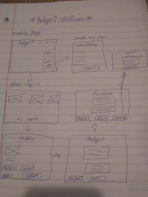

# Budget Up
Click to Launch Project:  <https://secret-fjord-87063.herokuapp.com/>   

Click to view User Story on Trello: <https://trello.com/b/FULD3vba/budget-up-app>

# Project Objective
### The goal of Budget Up is to track and manage your finances and set obtainable goals for yourself in an easy way

# Technologies Used
* Programming Languages - Node JS, Javascript, HTML, CSS
* Framework: Express JS
* Database: Mongo DB/Mongoose
* Visual Studio
* iTerm
* User Stories - Trello
* Host & Deploy - Heroku

# App Features
* Create, Update and delete Users
* Create, Update and delete Financial Goals
* Create, and delete Comments
* Create and delete Budgets
* Splash Page
* Responsive site, mobile friendly

# Wire Frame

# ERD

